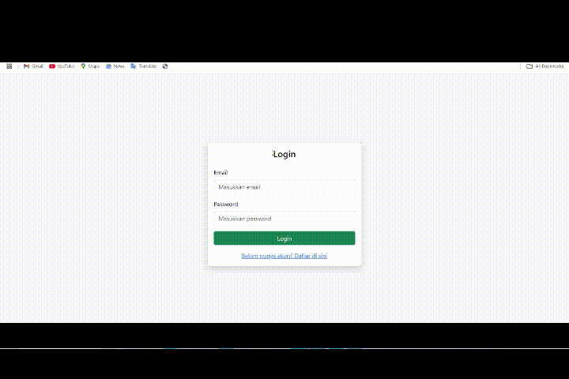

# 🔐 From Login & Registration V1 - PHP Native

## ✨ Kutipan

> *"Aku tidak berilmu; yang berilmu hanyalah DIA. Jika tampak ilmu dariku, itu hanyalah pantulan dari Cahaya-Nya."*

## 🎥 Demo


## 📜 Deskripsi
**Login & Registration V1** adalah proyek Login & Registration sederhana menggunakan PHP Native yang dirancang dengan struktur rapi dan memperhatikan keamanan dasar. Cocok untuk belajar atau membangun sistem autentikasi tanpa framework.

## 🎯 Fitur Utama

- ✅ Login & Register sederhana
- ✅ Password dienkripsi dengan `bcrypt`
- ✅ Session login untuk akses halaman terproteksi
- ✅ Tampilan dengan Bootstrap 5 (clean & responsive)
- ✅ Struktur direktori profesional (`config/`, `includes/`, `public/`)
- ✅ Komentar di setiap baris penting (mudah dipahami)
- ✅ Dukungan `.env` *(opsional Sudah Saya Zip Kalo Mau Digunakan)* untuk menyembunyikan    kredensial database

## 🛡️ Keamanan

- Menggunakan `password_hash()` dan `password_verify()`
- SQL injection dicegah dengan PDO prepared statements
- Session dicek dengan fungsi `isLoggedIn()`
- Password minimal 8 karakter
- `.env` opsional untuk menyembunyikan kredensial
- Bisa ditambah proteksi `.env` dengan `.htaccess` *(opsional Sudah Saya Zip Kalo Mau Digunakan)*

## 🔧 Dukungan `.env` (Opsional)

Jika ingin menjaga kredensial database tetap aman:

1. Buat file `.env` di root folder:
DB_HOST=localhost DB_NAME=login_v1 DB_USER=root DB_PASS=

2. Tambahkan kode untuk memuat `.env` di `database.php` (sudah tersedia di versi yang disiapkan zip)

3. Jangan upload `.env` ke publik – lindungi dengan `.htaccess` jika perlu

## Struktur Database
```sql
CREATE TABLE users (
  id INT AUTO_INCREMENT PRIMARY KEY,
  email VARCHAR(255) NOT NULL UNIQUE,
  password VARCHAR(255) NOT NULL,
  created_at TIMESTAMP DEFAULT CURRENT_TIMESTAMP
);
```

## 🚀 Cara Menggunakan

1. ** git clone https://github.com/Alghifari888/FromLogin-Registration.git atau download project ini**

2. **Import database**
   - Buat database baru (misalnya `login_v1`)
   - Jalankan SQL berikut di phpMyAdmin atau terminal:

     ```sql
     CREATE TABLE users (
         id INT AUTO_INCREMENT PRIMARY KEY,
         email VARCHAR(255) NOT NULL UNIQUE,
         password VARCHAR(255) NOT NULL,
         created_at TIMESTAMP DEFAULT CURRENT_TIMESTAMP
     );
     ```

3. **Atur koneksi database**
   - Langsung di `config/database.php`
   - Atau aktifkan dukungan `.env`:
     - Salin `.env.example` menjadi `.env`
     - Isi dengan konfigurasi database kamu

4. **Jalankan di server lokal**
   - Letakkan folder ini di `htdocs` (jika pakai XAMPP)
   - Akses melalui browser:  
     [http://localhost/login-v1/public](http://localhost/login-v1/public)


**Selamat belajar dan semoga bermanfaat!**  
✨ Kalau project ini membantu, boleh kasih ⭐ di GitHub ya!


